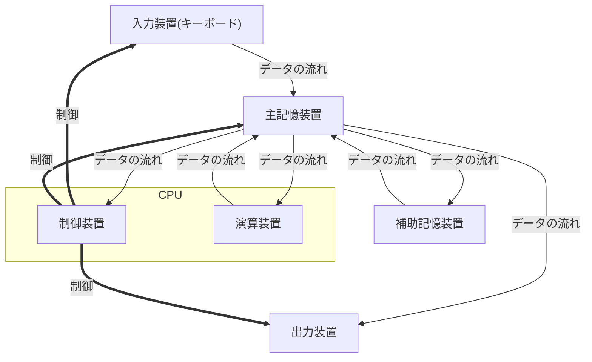

# コンピューターの仕組み（情報セキュリティ課題）

```mermaid
flowchart
a["入力装置(キーボード)"]
b["主記憶装置"]
c1["制御装置"]
c2["演算装置"]
d["出力装置"]
e["補助記憶装置"]

subgraph "CPU"
c1
c2
end

a--データの流れ-->b
b--データの流れ-->c1
b--データの流れ-->c2
c2--データの流れ-->b
b--データの流れ-->d
b--データの流れ-->e
e--データの流れ-->b
c1==制御==>a
c1==制御==>b
c1==制御==>d
```
